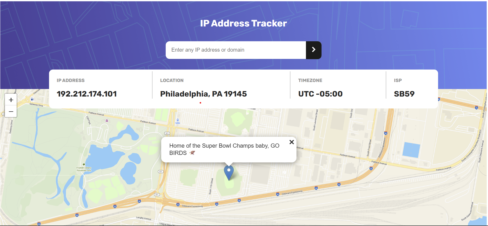

# IP Address Tracker

Welcome to my solution for the IP Address Tracker Challenge from Frontend Mentor. Enter in any ip address or domain you'd like, and watch the magic happen. 

- [IP Address Tracker](#ip-address-tracker)
  - [Overview](#overview)
    - [The challenge](#the-challenge)
    - [Screenshot](#screenshot)
    - [Links](#links)
    - [My process](#my-process)
    - [Built with](#built-with)
    - [What I learned](#what-i-learned)
      - [Tangible](#tangible)
      - [Intangible](#intangible)
    - [Resources](#resources)

## Overview

### The challenge

Users should be able to:

- View the optimal layout for each page depending on their device's screen size
- See hover states for all interactive elements on the page
- See their own IP address on the map on the initial page load
- Search for any IP addresses or domains and see the key information and location

### Screenshot

### Links

- https://vocal-jalebi-f507b1.netlify.app/

### My process 

I decided to approach this with OOP. At the beginning I broke the application down into parts, differentiating between backend and frontend. I prefer to begin with handling all of the backend work first, utilizing the console to debug. That way, when it comes time to wire the DOM into main, everything is rightfully contextualized. 

I started off with IP_Info.ts, with the intention to shape the IP information received from ipify in the api call. From there I went on to create the map service, first rendering it through html, and then trying to work backwards from that and derive my mapService.ts logic from there. I'll be honest, this one drove me a little crazy. But I struggled to the other side and found success. 

From here, I quickly wrote an error handler, looking in particular for issues with user input, network requests in the api, and data errors should I not receive the expected data type. 

The final portion of the backend was what I refer to as the big kahuna, the api call. I leveraged my Location class to shape the data, and my error class to handle errors in custom fashion, which was particularly useful later in the netlify deployment. I created an asynchronous function, returning a promise. I defined my regex and domain patterns, created tests for the input to discern user input, stored those tests in a ternary operator, and leveraged that operator in the construction of my url passed in the api call. From there, i created my fecth request in a try catch block, throwing back appropiate error messages if there was an issue with the api call. 

Once the backend was done and wired up, I moved onto fully structuring and styling the page. I first created the html structure, and then went to styling. Moving forward, bootstrap will be my go to, but for this project, I thought it better to utilize CSS and Flexbox to ensure proficiency. W3 Schools was a particularly useful resource in this.  

I then went on to cache DOM elements, and wire everything up in main. This involved a lot of checks to ensure the that each part of the process was flowing smoothly, but it was aided by checking each component as I created them.

### Built with

- Semantic HTML5 markup
- CSS custom properties
- Flexbox
- [Typescript](https://www.typescriptlang.org/) - JS Superset
- [Node.js](https://nodejs.org/en) - JS Runtime Environment
- [LiveServer](https://marketplace.visualstudio.com/items?itemName=ritwickdey.LiveServer) -   Local Dev Server

### What I learned

#### Tangible

In this project, the biggest thing I learned more about, was applying OOP principles. Here I was able to see the real time benefits of modularizing my project, and working to understand encapsulation to ensure proper importing and exporting of module components. I also saw the readability aspect of this, comparing and contrasting previous work I did in my Task Management App V2 and Blogging Platform. In particular, i noticed how I could break down my event listeners into helper functions, which help make things easier to follow when going through main. Now you can see the flow of method calls, and if something trips you up, you can just go back to that module. This also helps in ensuring each component of a program is working, adding a little more security when going to wire it up. 

I feel my understanding of DOM manipulation furthered a little bit, though the tethering process definitely intimidated me. 

The other very big lesson for me, was tsconfig, and understanding your local dev environment. The vast majority of issues I faced stemmed from my configuration options, and understanding how our gonfig tells the modules to be read. Trying to ue vite too early also killed me, making me hand in this later, because I just cinfused myself, which then frustrated myself, which then led me to delete the project folder and start from scratch. I'll get more into that in the intangibles section. 

#### Intangible 

At the onset of this project, my dad gave me a bit of advice. He said in AGILE methodology, there is a common phrase. "Fail. Fail early. Fail often." I think this project really helped put that in perspective for me. WHen things don't work in our code, is when we have an opportunity to truly understand the tools we are working with. I tried to anticipate some of my potential failures by using vite to circumvent issues I had on my previous project. Instead, I delayed an opportunity I had to employ this addage, and help get me to where I am now, with a much better understnding of local dev environment, and staying up with new updates to the tools we use. 

The other major intangible learning lesson, was to be more willing to take leaps of faith. I overthink and overplan, when in the end I sometimes make the most progress making a mistake a couple times, and furthering my understanding of what I am doing there. You just have to sometimes trust you are on the right path, and just be willing to check yourself in the process. I remember when it got time to ire up main, I was so in my head that i wasn't working on it piece by piece and seeing how my code behaved. And one thing that gives me confidence is that I can get a little creative in finding solutions. FOr instance, I wasn't getting mapService.ts to work and render, and so I decided to follow an example from maptiler verbatim and code it inline in my html which i dont like to do. But this gave me a little mental fortitude because i at least showed i could get the map to show, and then asserted to just work backwards from there in how to construct my mapService.ts logic. 

I had a couple existensial crises, but I made it. Time to take second at the bonfire, and then move to the next challenege. 

### Resources

IP Address Tracker Resources

Strategy

Conversation with my dad about OOP principles. I was contemplating putting all dom event listeners in their own util file and then the same with things like validating input. I wanted to adjust my thinking to reflect the mindset of an efficient dev, and pops spent the end of his it career building up jr and senior devs. It's nt just about the coding, but the best way to do the coding yknow?

I had a conversation with my colleague Karl about approach. He informed me he did html styling with bootstrap up front to work out design kinks. It's got me thinking, maybe i shouldn't look at it as doing all functionality and then styling. Now i'm kind of looking at it like, do whatever backend processes you need to do first, and then go back do some basic styling in preparation for dom wiring. The idea is to try and minimize the sources of errors you can receive. I would prefer to keep it to encountering js issues at one time, and html/css/bootstrap issues at another so as to not overwhelm myself.

Project Environment Setup

https://www.typescriptlang.org/tsconfig/

https://www.typescriptlang.org/tsconfig/#moduleResolution

https://www.typescriptlang.org/docs/handbook/tsconfig-json.html

vite intro'd by scrimba

Videos about Vite
https://www.youtube.com/watch?v=KCrXgy8qtjM
https://www.youtube.com/watch?v=DkGV5F4XnfQ

https://vite.dev/guide/

***Vite ended up messing me up, i went that route hoping to avoid ts config issues i faced in sba 6, but i ended up running into more issues. I will just look up optimal ts configs to try and avoid that***

Models 

IP_Info.ts

https://geo.ipify.org/docs

E Commerce System, Task Management App V2, and Blogging Platform repositories - referencing how to shape api data, and further contemplation of how to handle helper functions. 

map.ts

https://leafletjs.com/examples/quick-start/

https://leafletjs.com/reference.html#map-methods-for-getting-map-state

https://leafletjs.com/index.html

https://www.youtube.com/watch?v=wVnimcQsuwk - this is proving to be the most useful

https://www.typescriptlang.org/docs/handbook/declaration-files/by-example.html

errorHandler.ts 

E Commerce System, Task Management App V2, and Blogging Platform repositories - to help with the error handler and input validation

https://developer.mozilla.org/en-US/docs/Web/JavaScript/Reference/Global_Objects/Object/valueOf

https://regex101.com/ 

ipApiService.ts 

E Commerce Repository - fetchProductData.ts

https://geo.ipify.org/code-samples

index.html 

starter code from frontend mentor - cut and pasted from the starter html into one i did from scratch to check the map

Task Management App V2, and Blogging Platform repositories - index.html

css

https://css-tricks.com/inheriting-box-sizing-probably-slightly-better-best-practice/

https://www.w3schools.com/css/default.asp

styleguide

accessible design co in my GitHub for @media

Task Management App V2, and Blogging Platform repositories

main.ts 

E Commerce System, Task Management App V2, and Blogging Platform repositories

search fix for domains:

https://developer.mozilla.org/en-US/docs/Web/JavaScript/Reference/Operators/Conditional_operator

https://geo.ipify.org/docs

netlify:

https://youtu.be/etZ9HSUoTPU?si=322Su6QCAeBLM9Km

Special thank you to Frontend Mentor for the challenege, and to  IP Geolocation API by IPify,  LeafletJS, and MapTiler for allowing me to complete the challenge. 